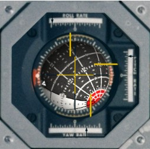

# webFDAI



A [Web Component](https://developer.mozilla.org/en-US/docs/Web/Web_Components) representing a [FDAI
(Flight Director Attitude Indicator)](https://history.nasa.gov/afj/ap16fj/01popup_fdai.html) used in
the the [Apollo program](https://en.wikipedia.org/wiki/Apollo_program), based on a cabin close-out
[photograph](https://www.hq.nasa.gov/alsj/a15/lm10-co1.jpg) of *Falcon*, the Lunar Module of Apollo
15 (more photos are linked from [here](https://www.hq.nasa.gov/alsj/a15/a15LMCloseOutPhotos.html)).

## Usage

```javascript
const fdai = document.createElement('web-fdai');
fdai.addEventListener('ready', () => {
  fdai.yaw = Math.PI / 4;
  fdai.render();
});
document.body.appendChild(fdai); // will emit the 'ready' event
```

The '8-ball' can be rolled, yawed, and pitched (in that order, as implemented in hardware) by
setting the `roll`, `yaw`, and `pitch` attributes of the component (radians). The roll index needle
is controlled by the `roll` attribute as well. The error needles are controlled by the `rollError`,
`yawError` and `pitchError` attributes (range *[-1, 1]*). The rate needles are controlled by the
`rollRate`, `yawRate`, and `pitchRate` attributes (range *[-1, 1]*). After all attributes are set,
call `render()` on the component.

## Demo

```sh
npm ci
npx web-dev-server
open http://localhost:8001/demo
```

## Credits

The included '8-ball' texture was adapted from one of the texture examples posted at https://forum.kerbalspaceprogram.com/index.php?/topic/164158-13-navballtexturechanger-v16-8717/&do=findComment&comment=3142105
